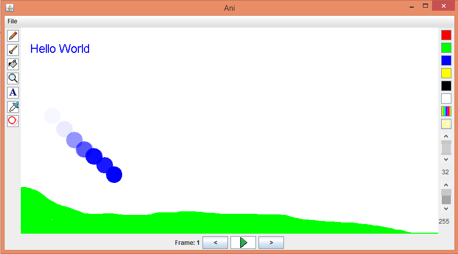

<h2>Ani - Animation Program</h2>

<b>Ani</b> allows the user to draw on the canvas using several tools such as : Paint brush, Pencil, Bucket, Text, and Zoom. To move to the next from the using simply has to click the arrow pointing right next to the play button. When the animation is finnished you can click play and watch. The user also has the ablilty to save and load images.

